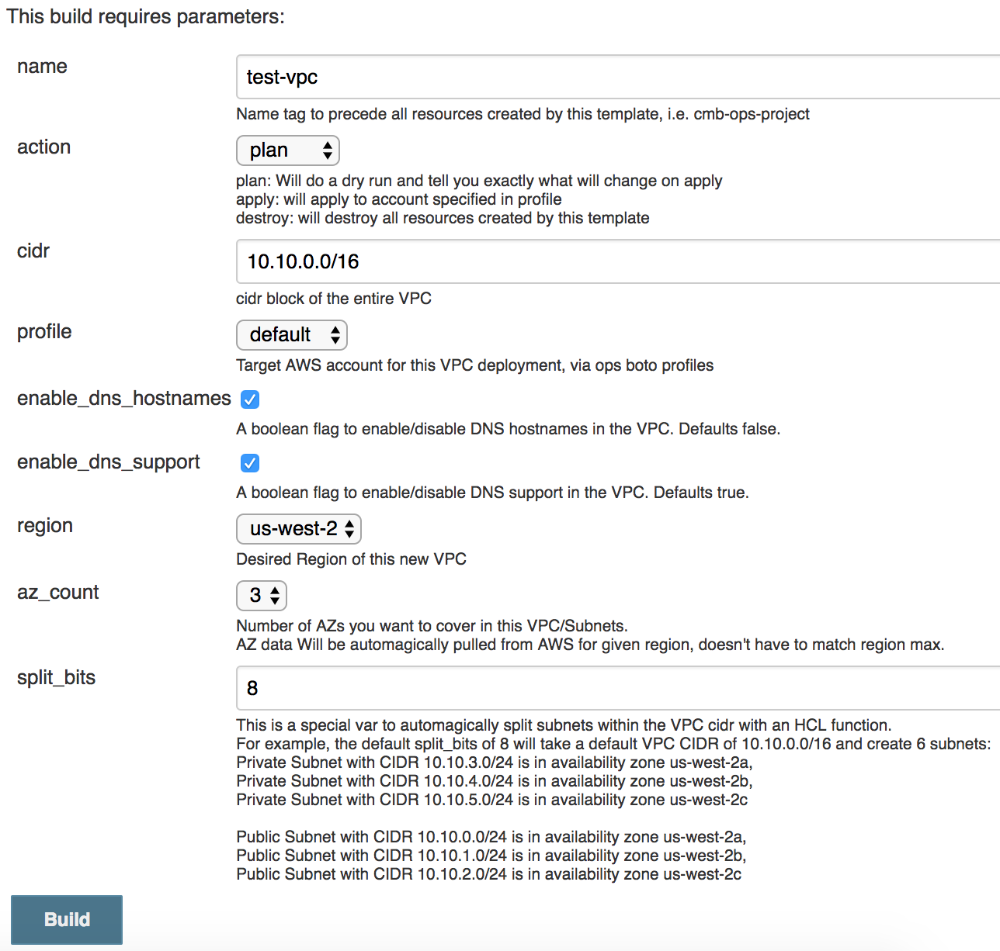

vpc-in-a-box
=========

Using the boto profiles on your control machine (Jenkins in this instance) This automation will quickly spin up a VPC, public subnets in x AZs with an internet gw, x private subnets in x AZs with Nat Gateway and x route tables for x private subnets.


How to use
------------
Configure Jenkins job parameters like so:


Jenkins Script:
```bash
rm -rf .terraform
bash -x tfstate/configure-remote-state.sh
echo "yes" | terraform ${action} \
  -var name=${name} \
  -var cidr=${cidr} \
  -var profile=${profile} \
  -var split_bits=${split_bits} \
  -var enable_dns_hostnames=${enable_dns_hostnames} \
  -var enable_dns_support=${enable_dns_support} \
  -var region=${region} \
  -var az_count=${az_count}
```

Module Variables
--------------

Most important variables to change are:
```
variable "name" { default = "fleet" }
variable "cidr" { default = "10.0.0.0/16" }
```
**name:** Name tag to precede all resources created by this template

**cidr:** The VPC block you are splitting

profile: The Jenkins local ~/.aws/credentials profile to use for this deployment

split_bits: This is a special var to automagically split subnets within the VPC CIDR with an HCL function.  

az_count: Number of AZs you want to cover in this VPC/Subnets.
AZ data Will be automagically pulled from AWS for given region, doesn't have to match region max.


Module defaults
--------------

3 AZs with the following CIDRs enabling DNS support and hostnames:
```
private = [
    Private Subnet with CIDR 10.10.3.0/24 is in availability zone us-west-2a,
    Private Subnet with CIDR 10.10.4.0/24 is in availability zone us-west-2b,
    Private Subnet with CIDR 10.10.5.0/24 is in availability zone us-west-2c
]
public = [
    Public Subnet with CIDR 10.10.0.0/24 is in availability zone us-west-2a,
    Public Subnet with CIDR 10.10.1.0/24 is in availability zone us-west-2b,
    Public Subnet with CIDR 10.10.2.0/24 is in availability zone us-west-2c
]
```

Module Reference Example
----------------

```
```

Roadmap
----------------
- Allow Adding Network ACL

License
-------

MIT

Author Information
------------------

@andymotta
